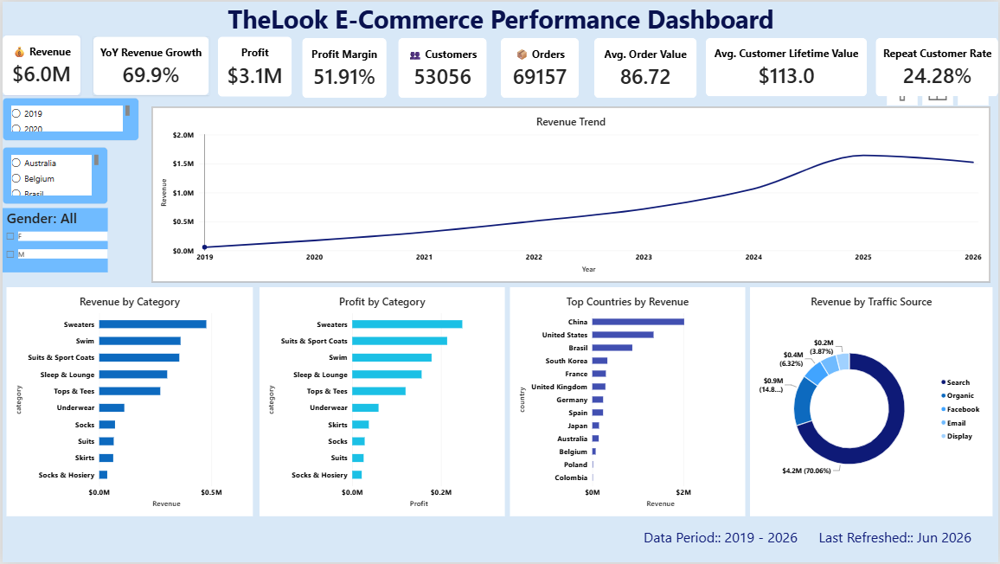

# TheLook E-Commerce Analytics Dashboard

## Dashboard Preview

## Project Overview

This project analyzes customer behavior, product performance, profitability, and marketing effectiveness using the TheLook E-Commerce dataset from Google BigQuery.

Using SQL, BigQuery, Power BI, and DAX, I built an interactive 4-page Business Intelligence dashboard covering Executive Overview, Customer Analytics, Product & Profitability Analytics, and Marketing Analytics.

The dashboard helps identify key revenue drivers, customer segments, profitable product categories, and high-performing acquisition channels.

## Project Highlights

- Analyzed 181K+ order item records and 125K+ orders
- Built a Star Schema data model in Power BI
- Created 20+ DAX measures and KPIs
- Developed a 4-page interactive Business Intelligence dashboard
- Analyzed customer behavior, product profitability, and marketing performance

## Tools & Technologies

- SQL
- Google BigQuery
- Power BI
- DAX
- Data Modeling (Star Schema)

## Dataset

Source: Google BigQuery Public Dataset (TheLook E-Commerce)

Tables Used:
- users
- orders
- order_items
- products

Records:
- Users: 100,000
- Orders: 125,270
- Order Items: 181,662
- Products: 29,120

Analysis Period:
2019 – 2026

## Skills Demonstrated

- SQL Querying
- Data Cleaning
- Exploratory Data Analysis
- KPI Development
- DAX Measures
- Data Modeling
- Power BI Dashboarding
- Business Intelligence
- Data Visualization

## Dashboard Pages

### Executive Overview
- Revenue
- Profit
- Customers
- Orders
- AOV
- CLV
- Revenue Trends

screenshots/Executive_Overview.png

### Customer Analytics
- Customer Segmentation
- Repeat Customer Analysis
- Revenue by Age Group
- Customer Distribution

### Product & Profitability Analytics
- Category Profitability
- Brand Performance
- Revenue vs Profit Analysis

### Marketing Analytics
- Channel Performance
- Customer Acquisition Trends
- Revenue Contribution by Traffic Source

## Key Insights

- Generated nearly $6M in revenue from 69K completed/shipped orders.
- Repeat customer rate was 24.28%.
- Search traffic contributed approximately 70% of total revenue.
- Outerwear & Coats generated the highest revenue and profit.
- Average Customer Lifetime Value (CLV) was $113.
- Revenue showed strong year-over-year growth from 2019 to 2026.

## Dashboard Screenshots

### Customer Analytics

### Product & Profitability Analytics

### Marketing Analytics

## Repository Structure

├── SQL
├── PowerBI
├── Images
├── Documentation
└── README.md

## Author

Ramyashree GV

Data Analyst | SQL | Python | Power BI | Excel | Business Intelligence
